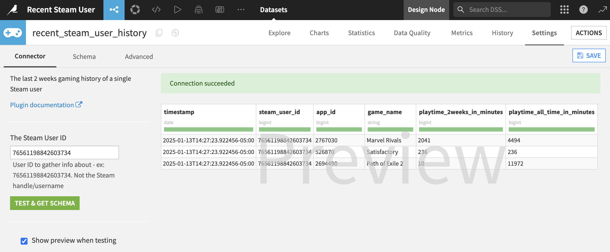
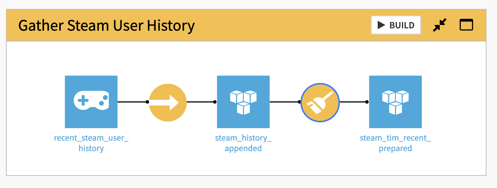

# Dataiku DSS plugin for Steam

This repository contains a plugin for Dataiku DSS that adds support for using Steam data as a dataset in your projects.

The plugin connects to Steam’s REST API to gather the recent gaming history of a single Steam user. You can use it to automatically update a dataset on a schedule (for example, daily or weekly).

Since Steam does not provide detailed information about individual gaming sessions, this plugin helps you estimate how much time a user spends playing games per day or week. It uses the ```IPlayerService/GetRecentlyPlayedGames``` API endpoint to collect data.


# Screenshots
Example of this plugin connected to a public Steam account:


Example of this plugin in a Dataiku flow:


# How to use the plugin
This plugin was tested on Dataiku DSS v13.2.2. You will need a Steam API key to use it.

Steps:
1.	Find the Steam User ID:
* Use the [Steam ID Finder website](https://www.steamidfinder.com/) to locate the Steam User ID for the account you want to track.
* The Steam User ID is a long number, for example: ```76561198842603734```

2.	Get a Steam API Key:
* Log in to the Steam website.
* Visit this page: [Steam Developer API](https://steamcommunity.com/login/home/?goto=%2Fdev%2Fapikey)
* Follow the instructions to generate your API key.

3.	Install the Plugin in Dataiku DSS:
* Open your Dataiku DSS instance.
* Go to the Plugin Management section.
* Select Add Plugin and choose Fetch from Git Repository.
* Enter this URL: ```git@github.com:THE-MOLECULAR-MAN/dataiku-plugin-steam-user-history.git```
* Click Clone and leave other options as they are.

4.	Add the Steam API Key to Your Project:
* Open your Dataiku project or create a new one.
* Go to Project Variables and add a new variable called STEAM_API_KEY.
* Paste your Steam API key here, including the quotation marks. Example:
```
{
  "STEAM_API_KEY": "0000090B0CD8D8DB900000AC00D00000"
}

```

5.	Test the Plugin:
* Use the default Steam User IDs to test the connection.
* Click Test & Get Schema to verify that it works. You should see the recent gaming history for the users.

6.	Create a Dataset:
* Click Create to save the data connection.
* Use a Sync Recipe to save the results to a permanent dataset, such as a CSV file or PostgreSQL table.
* In the Sync Recipe, enable the option Append instead of overwrite to keep adding new data instead of replacing old data.

7.	Automate Data Updates (Optional):
* Create a Scenario in Dataiku.
* Add a Time Trigger to run the plugin daily or weekly.
* Add a step to perform a Build (forced rebuild) on the output dataset.


# Possible Future Features
* Collect the user’s full game library using IPlayerService/GetOwnedGames and track playtime for each game.
* Retrieve Steam achievement data to estimate when a game was first played.
 
# References
* https://partner.steamgames.com/doc/webapi/IPlayerService#GetRecentlyPlayedGames
* https://partner.steamgames.com/doc/webapi_overview#2
